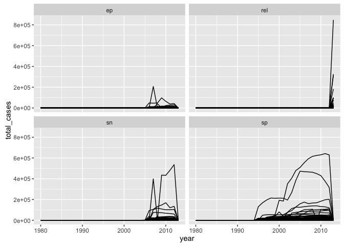

tidyverse
================
Michael Levy, Prepared for the Davis R-Users' Group
October 13, 2016

What is the tidyverse?
----------------------

~~Hadleyverse~~

The tidyverse is a suite of R tools that follow a tidy philosophy:

### Tidy data

Put data in data frames

-   Each type of observation gets a data frame
-   Each variable gets a column
-   Each observation gets a row

### Tidy APIs

Functions should be consistent and easily (human) readable

-   Take one step at a time
-   Connect simple steps with the pipe
-   Referential transparency

### Okay but really, what is it?

Suite of ~20 packages that provide consistent, user-friendly, smart-default tools to do most of what most people do in R.

-   Core packages: ggplot2, dplyr, tidyr, readr, purrr, tibble
-   Specialized data manipulation: hms, stringr, lubridate, forcats
-   Data import: DBI, haven, httr, jsonlite, readxl, rvest, xml2
-   Modeling: modelr, broom

`install.packages(tidyverse)` installs all of the above packages.

`library(tidyverse)` attaches only the core packages.

Why tidyverse?
--------------

-   Consistency
    -   e.g. All `stringr` functions take string first
    -   e.g. Many functions take data.frame first -&gt; piping
        -   Faster to write
        -   Easier to read
    -   Tidy data: Imposes good practices
    -   Type specification
-   You probably use some of it already. Synergize.
-   Implements simple solutions to common problems (e.g. `purrr`!)
-   Smarter defaults
    -   e.g. `utils::write.csv(row.names = FALSE)` = `readr::write_csv()`
-   Runs fast (thanks to `Rcpp`)
-   Interfaces well with other tools (e.g. Spark with `dplyr` via `sparklyr`)

`tibble`
--------

> A modern reimagining of data frames.

``` r
library(tidyverse)
```

    ## Loading tidyverse: ggplot2
    ## Loading tidyverse: tibble
    ## Loading tidyverse: tidyr
    ## Loading tidyverse: readr
    ## Loading tidyverse: purrr
    ## Loading tidyverse: dplyr

    ## Conflicts with tidy packages ----------------------------------------------

    ## filter(): dplyr, stats
    ## lag():    dplyr, stats

``` r
tdf = tibble(x = 1:1e4, y = rnorm(1e4))  # == data_frame(x = 1:1e4, y = rnorm(1e4))
class(tdf)
```

    ## [1] "tbl_df"     "tbl"        "data.frame"

Tibbles print politely.

``` r
tdf
```

    ## # A tibble: 10,000 × 2
    ##        x           y
    ##    <int>       <dbl>
    ## 1      1 -0.05985947
    ## 2      2  0.36991681
    ## 3      3  0.55610851
    ## 4      4 -0.18125650
    ## 5      5 -0.93476016
    ## 6      6 -0.66538208
    ## 7      7  0.60730674
    ## 8      8  0.84813702
    ## 9      9  0.16010145
    ## 10    10 -0.69335896
    ## # ... with 9,990 more rows

-   Can customize print methods with `print(tdf, n = rows, width = cols)`

-   Set default with `options(tibble.print_max = rows, tibble.width = cols)`

Tibbles have some convenient and consistent defaults that are different from base R data.frames.

#### strings as factors

``` r
dfs = list(
  df = data.frame(abc = letters[1:3], xyz = letters[24:26]),
  tbl = data_frame(abc = letters[1:3], xyz = letters[24:26])
)
sapply(dfs, function(d) class(d$abc))
```

    ##          df         tbl 
    ##    "factor" "character"

#### partial matching of names

``` r
sapply(dfs, function(d) d$a)
```

    ## Warning: Unknown column 'a'

    ## $df
    ## [1] a b c
    ## Levels: a b c
    ## 
    ## $tbl
    ## NULL

#### type consistency

``` r
sapply(dfs, function(d) class(d[, "abc"]))
```

    ## $df
    ## [1] "factor"
    ## 
    ## $tbl
    ## [1] "tbl_df"     "tbl"        "data.frame"

Note that tidyverse import functions (e.g. `readr::read_csv`) default to tibbles and that *this can break existing code*.

#### List-columns!

``` r
tibble(x = lapply(1:5, function(x) x^(1:x)))
```

    ## # A tibble: 5 × 1
    ##           x
    ##      <list>
    ## 1 <dbl [1]>
    ## 2 <dbl [2]>
    ## 3 <dbl [3]>
    ## 4 <dbl [4]>
    ## 5 <dbl [5]>

The pipe `%>%`
--------------

Sends the output of the LHS function to the first argument of the RHS function.

``` r
sum(1:8) %>%
  sqrt()
```

    ## [1] 6

`dplyr`
-------

Common data(frame) manipulation taks.

Four core "verbs": filter, select, arrange, group\_by + summarize, plus many more convenience functions.

``` r
library(ggplot2movies)
str(movies)
```

    ## Classes 'tbl_df', 'tbl' and 'data.frame':    58788 obs. of  24 variables:
    ##  $ title      : chr  "$" "$1000 a Touchdown" "$21 a Day Once a Month" "$40,000" ...
    ##  $ year       : int  1971 1939 1941 1996 1975 2000 2002 2002 1987 1917 ...
    ##  $ length     : int  121 71 7 70 71 91 93 25 97 61 ...
    ##  $ budget     : int  NA NA NA NA NA NA NA NA NA NA ...
    ##  $ rating     : num  6.4 6 8.2 8.2 3.4 4.3 5.3 6.7 6.6 6 ...
    ##  $ votes      : int  348 20 5 6 17 45 200 24 18 51 ...
    ##  $ r1         : num  4.5 0 0 14.5 24.5 4.5 4.5 4.5 4.5 4.5 ...
    ##  $ r2         : num  4.5 14.5 0 0 4.5 4.5 0 4.5 4.5 0 ...
    ##  $ r3         : num  4.5 4.5 0 0 0 4.5 4.5 4.5 4.5 4.5 ...
    ##  $ r4         : num  4.5 24.5 0 0 14.5 14.5 4.5 4.5 0 4.5 ...
    ##  $ r5         : num  14.5 14.5 0 0 14.5 14.5 24.5 4.5 0 4.5 ...
    ##  $ r6         : num  24.5 14.5 24.5 0 4.5 14.5 24.5 14.5 0 44.5 ...
    ##  $ r7         : num  24.5 14.5 0 0 0 4.5 14.5 14.5 34.5 14.5 ...
    ##  $ r8         : num  14.5 4.5 44.5 0 0 4.5 4.5 14.5 14.5 4.5 ...
    ##  $ r9         : num  4.5 4.5 24.5 34.5 0 14.5 4.5 4.5 4.5 4.5 ...
    ##  $ r10        : num  4.5 14.5 24.5 45.5 24.5 14.5 14.5 14.5 24.5 4.5 ...
    ##  $ mpaa       : chr  "" "" "" "" ...
    ##  $ Action     : int  0 0 0 0 0 0 1 0 0 0 ...
    ##  $ Animation  : int  0 0 1 0 0 0 0 0 0 0 ...
    ##  $ Comedy     : int  1 1 0 1 0 0 0 0 0 0 ...
    ##  $ Drama      : int  1 0 0 0 0 1 1 0 1 0 ...
    ##  $ Documentary: int  0 0 0 0 0 0 0 1 0 0 ...
    ##  $ Romance    : int  0 0 0 0 0 0 0 0 0 0 ...
    ##  $ Short      : int  0 0 1 0 0 0 0 1 0 0 ...

``` r
filter(movies, length > 360)
```

    ## # A tibble: 21 × 24
    ##                                               title  year length  budget
    ##                                               <chr> <int>  <int>   <int>
    ## 1                         Commune (Paris, 1871), La  2000    555      NA
    ## 2                            Cure for Insomnia, The  1987   5220      NA
    ## 3             Ebolusyon ng isang pamilyang pilipino  2004    647      NA
    ## 4                                            Empire  1964    485      NA
    ## 5                                Farmer's Wife, The  1998    390      NA
    ## 6                                     Foolish Wives  1922    384 1100000
    ## 7                                        Four Stars  1967   1100      NA
    ## 8                 Hitler - ein Film aus Deutschland  1978    407      NA
    ## 9                               Imitation of Christ  1967    480      NA
    ## 10 Longest Most Meaningless Movie in the World, The  1970   2880      NA
    ## # ... with 11 more rows, and 20 more variables: rating <dbl>, votes <int>,
    ## #   r1 <dbl>, r2 <dbl>, r3 <dbl>, r4 <dbl>, r5 <dbl>, r6 <dbl>, r7 <dbl>,
    ## #   r8 <dbl>, r9 <dbl>, r10 <dbl>, mpaa <chr>, Action <int>,
    ## #   Animation <int>, Comedy <int>, Drama <int>, Documentary <int>,
    ## #   Romance <int>, Short <int>

``` r
filter(movies, length > 360) %>%
  select(title, rating, votes)
```

    ## # A tibble: 21 × 3
    ##                                               title rating votes
    ##                                               <chr>  <dbl> <int>
    ## 1                         Commune (Paris, 1871), La    7.8    33
    ## 2                            Cure for Insomnia, The    3.8    59
    ## 3             Ebolusyon ng isang pamilyang pilipino    8.4     5
    ## 4                                            Empire    5.5    46
    ## 5                                Farmer's Wife, The    8.5    52
    ## 6                                     Foolish Wives    7.6   191
    ## 7                                        Four Stars    3.0    12
    ## 8                 Hitler - ein Film aus Deutschland    9.0    70
    ## 9                               Imitation of Christ    4.4     5
    ## 10 Longest Most Meaningless Movie in the World, The    6.4    15
    ## # ... with 11 more rows

``` r
filter(movies, Animation == 1, votes > 1000) %>%
  select(title, rating) %>%
  arrange(desc(rating))
```

    ## # A tibble: 135 × 2
    ##                                   title rating
    ##                                   <chr>  <dbl>
    ## 1         Sen to Chihiro no kamikakushi    8.6
    ## 2                            Duck Amuck    8.4
    ## 3  Wallace & Gromit: The Wrong Trousers    8.4
    ## 4                          Finding Nemo    8.3
    ## 5                        Hotaru no haka    8.3
    ## 6                      Incredibles, The    8.3
    ## 7                         Mononoke-hime    8.3
    ## 8                    What's Opera, Doc?    8.3
    ## 9                               Vincent    8.2
    ## 10      Wallace & Gromit: A Close Shave    8.2
    ## # ... with 125 more rows

`summarize` makes `aggregate` and `tapply` functionality easier, and the output is always a data frame.

``` r
filter(movies, mpaa != "") %>%
  group_by(year, mpaa) %>%
  summarize(avg_budget = mean(budget, na.rm = TRUE),
            avg_rating = mean(rating, na.rm = TRUE)) %>%
  arrange(desc(year), mpaa)
```

    ## Source: local data frame [128 x 4]
    ## Groups: year [54]
    ## 
    ##     year  mpaa avg_budget avg_rating
    ##    <int> <chr>      <dbl>      <dbl>
    ## 1   2005 NC-17        NaN   6.700000
    ## 2   2005    PG   45857143   5.733333
    ## 3   2005 PG-13   42269333   5.326087
    ## 4   2005     R   24305882   4.595833
    ## 5   2004    PG   45126852   5.847619
    ## 6   2004 PG-13   46288254   6.080180
    ## 7   2004     R   19548519   5.848469
    ## 8   2003    PG   37057692   5.897674
    ## 9   2003 PG-13   46269491   5.949038
    ## 10  2003     R   21915505   5.702273
    ## # ... with 118 more rows

`count` for frequency tables. Note the consistent API and easy readability vs. `table`.

``` r
filter(movies, mpaa != "") %>%
  count(year, mpaa, Animation, sort = TRUE)
```

    ## Source: local data frame [156 x 4]
    ## Groups: year, mpaa [128]
    ## 
    ##     year  mpaa Animation     n
    ##    <int> <chr>     <int> <int>
    ## 1   1999     R         0   366
    ## 2   2001     R         0   355
    ## 3   2002     R         0   343
    ## 4   2000     R         0   341
    ## 5   1998     R         0   335
    ## 6   1997     R         0   325
    ## 7   1996     R         0   310
    ## 8   1995     R         0   293
    ## 9   2003     R         0   264
    ## 10  2004     R         0   196
    ## # ... with 146 more rows

``` r
basetab = with(movies[movies$mpaa != "", ], table(year, mpaa, Animation))
basetab[1:5, , ]
```

    ## , , Animation = 0
    ## 
    ##       mpaa
    ## year   NC-17 PG PG-13 R
    ##   1934     0  1     0 0
    ##   1938     0  1     0 0
    ##   1945     0  0     1 0
    ##   1946     0  1     0 0
    ##   1951     0  2     0 0
    ## 
    ## , , Animation = 1
    ## 
    ##       mpaa
    ## year   NC-17 PG PG-13 R
    ##   1934     0  0     0 0
    ##   1938     0  0     0 0
    ##   1945     0  0     0 0
    ##   1946     0  0     0 0
    ##   1951     0  0     0 0

`tidyr`
-------

Latest generation of `reshape`. `gather` to make wide table long, `spread` to make long tables wide.

``` r
who
```

    ## # A tibble: 7,240 × 60
    ##        country  iso2  iso3  year new_sp_m014 new_sp_m1524 new_sp_m2534
    ##          <chr> <chr> <chr> <int>       <int>        <int>        <int>
    ## 1  Afghanistan    AF   AFG  1980          NA           NA           NA
    ## 2  Afghanistan    AF   AFG  1981          NA           NA           NA
    ## 3  Afghanistan    AF   AFG  1982          NA           NA           NA
    ## 4  Afghanistan    AF   AFG  1983          NA           NA           NA
    ## 5  Afghanistan    AF   AFG  1984          NA           NA           NA
    ## 6  Afghanistan    AF   AFG  1985          NA           NA           NA
    ## 7  Afghanistan    AF   AFG  1986          NA           NA           NA
    ## 8  Afghanistan    AF   AFG  1987          NA           NA           NA
    ## 9  Afghanistan    AF   AFG  1988          NA           NA           NA
    ## 10 Afghanistan    AF   AFG  1989          NA           NA           NA
    ## # ... with 7,230 more rows, and 53 more variables: new_sp_m3544 <int>,
    ## #   new_sp_m4554 <int>, new_sp_m5564 <int>, new_sp_m65 <int>,
    ## #   new_sp_f014 <int>, new_sp_f1524 <int>, new_sp_f2534 <int>,
    ## #   new_sp_f3544 <int>, new_sp_f4554 <int>, new_sp_f5564 <int>,
    ## #   new_sp_f65 <int>, new_sn_m014 <int>, new_sn_m1524 <int>,
    ## #   new_sn_m2534 <int>, new_sn_m3544 <int>, new_sn_m4554 <int>,
    ## #   new_sn_m5564 <int>, new_sn_m65 <int>, new_sn_f014 <int>,
    ## #   new_sn_f1524 <int>, new_sn_f2534 <int>, new_sn_f3544 <int>,
    ## #   new_sn_f4554 <int>, new_sn_f5564 <int>, new_sn_f65 <int>,
    ## #   new_ep_m014 <int>, new_ep_m1524 <int>, new_ep_m2534 <int>,
    ## #   new_ep_m3544 <int>, new_ep_m4554 <int>, new_ep_m5564 <int>,
    ## #   new_ep_m65 <int>, new_ep_f014 <int>, new_ep_f1524 <int>,
    ## #   new_ep_f2534 <int>, new_ep_f3544 <int>, new_ep_f4554 <int>,
    ## #   new_ep_f5564 <int>, new_ep_f65 <int>, newrel_m014 <int>,
    ## #   newrel_m1524 <int>, newrel_m2534 <int>, newrel_m3544 <int>,
    ## #   newrel_m4554 <int>, newrel_m5564 <int>, newrel_m65 <int>,
    ## #   newrel_f014 <int>, newrel_f1524 <int>, newrel_f2534 <int>,
    ## #   newrel_f3544 <int>, newrel_f4554 <int>, newrel_f5564 <int>,
    ## #   newrel_f65 <int>

``` r
who %>%
  gather(group, cases, -country, -iso2, -iso3, -year)
```

    ## # A tibble: 405,440 × 6
    ##        country  iso2  iso3  year       group cases
    ##          <chr> <chr> <chr> <int>       <chr> <int>
    ## 1  Afghanistan    AF   AFG  1980 new_sp_m014    NA
    ## 2  Afghanistan    AF   AFG  1981 new_sp_m014    NA
    ## 3  Afghanistan    AF   AFG  1982 new_sp_m014    NA
    ## 4  Afghanistan    AF   AFG  1983 new_sp_m014    NA
    ## 5  Afghanistan    AF   AFG  1984 new_sp_m014    NA
    ## 6  Afghanistan    AF   AFG  1985 new_sp_m014    NA
    ## 7  Afghanistan    AF   AFG  1986 new_sp_m014    NA
    ## 8  Afghanistan    AF   AFG  1987 new_sp_m014    NA
    ## 9  Afghanistan    AF   AFG  1988 new_sp_m014    NA
    ## 10 Afghanistan    AF   AFG  1989 new_sp_m014    NA
    ## # ... with 405,430 more rows

`ggplot2`
---------

If you don't already know and love it, check out [one of](https://d-rug.github.io/blog/2012/ggplot-introduction) [our](https://d-rug.github.io/blog/2013/xtsmarkdown) [previous](https://d-rug.github.io/blog/2013/formatting-plots-for-pubs) [talks](https://d-rug.github.io/blog/2015/ggplot-tutorial-johnston) on ggplot or any of the excellent resources on the internet.

Note that the pipe and consistent API make it easy to combine functions from different packages, and the whole thing is quite readable.

``` r
who %>%
  select(-iso2, -iso3) %>%
  gather(group, cases, -country, -year) %>%
  count(country, year, wt = cases) %>%
  ggplot(aes(x = year, y = n, group = country)) +
  geom_line(size = .2) 
```


`readr`
-------

For reading flat files. Faster than base with smarter defaults.

``` r
bigdf = data_frame(int = 1:1e6, 
                   squares = int^2, 
                   letters = sample(letters, 1e6, replace = TRUE))
```

``` r
system.time(
  write.csv(bigdf, "base-write.csv")
)
```

    ##    user  system elapsed 
    ##   2.803   0.138   3.081

``` r
system.time(
  write_csv(bigdf, "readr-write.csv")
)
```

    ##    user  system elapsed 
    ##   0.903   0.089   1.125

``` r
read.csv("base-write.csv", nrows = 3)
```

    ##   X int squares letters
    ## 1 1   1       1       o
    ## 2 2   2       4       u
    ## 3 3   3       9       n

``` r
read_csv("readr-write.csv", n_max = 3)
```

    ## Parsed with column specification:
    ## cols(
    ##   int = col_integer(),
    ##   squares = col_double(),
    ##   letters = col_character()
    ## )

    ## # A tibble: 3 × 3
    ##     int squares letters
    ##   <int>   <dbl>   <chr>
    ## 1     1       1       o
    ## 2     2       4       u
    ## 3     3       9       n

------------------------------------------------------------------------

For stringr...

``` r
library(stringr)
who %>%
    select(-iso2, -iso3) %>%
    gather(group, cases, -country, -year) %>%
    mutate(group = str_replace(group, "(new_)|(new)", ""),
           method = str_extract(group, "[a-z]+"),
           gender = str_sub(str_extract(group, "_[a-z]"), 2, 2),
           age_group = str_extract(group, "[0-9]+")) %>%
    group_by(country, year, method) %>%
    summarize(total_cases = sum(cases, na.rm = TRUE)) %>%
    ggplot(aes(x = year, y = total_cases, group = country)) +
    geom_line() +
    facet_wrap(~ method)
```


